# Planar Monopole Antenna Project

This repository contains all the resources related to the **Planar Monopole Antenna for Wireless and Energy Harvesting Applications**.

## 📸 Project Images

Below are the sequential images demonstrating various stages and components of the project:

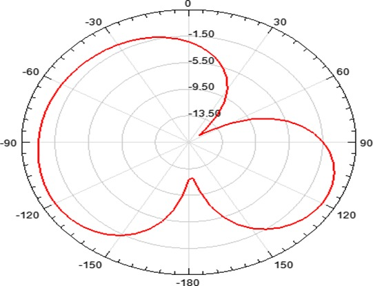

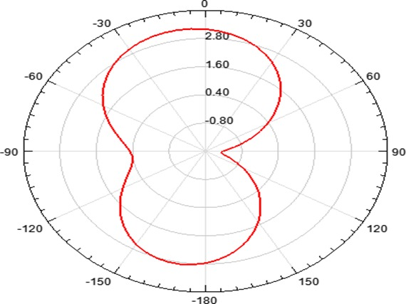

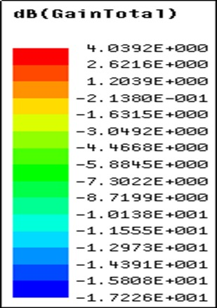

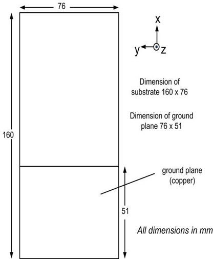

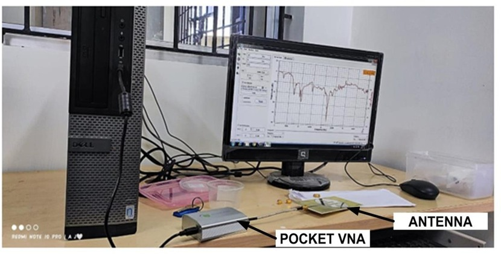

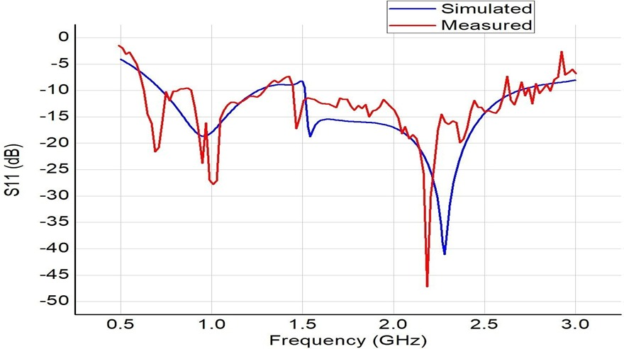

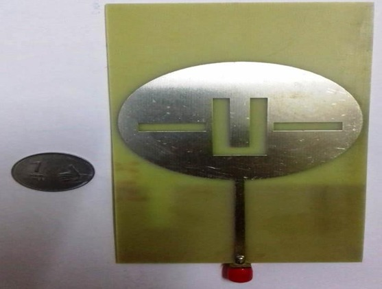

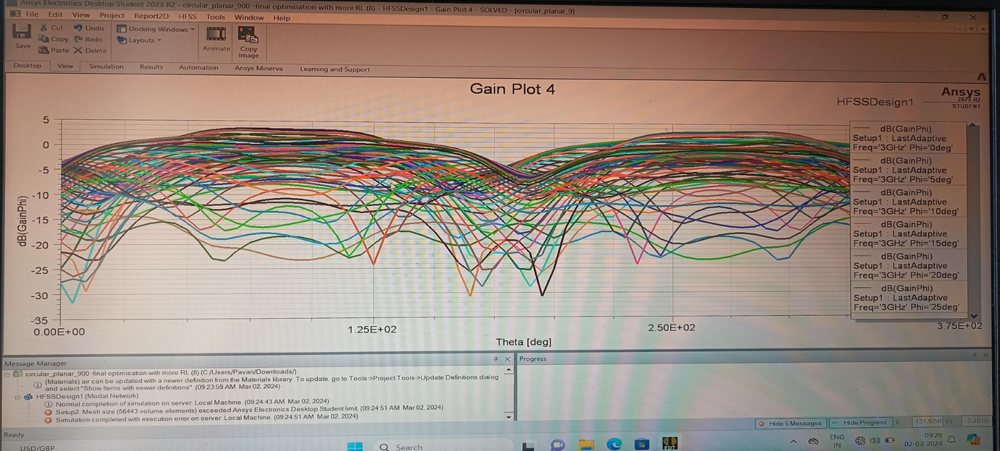

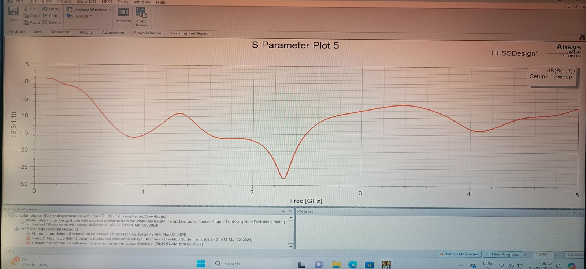

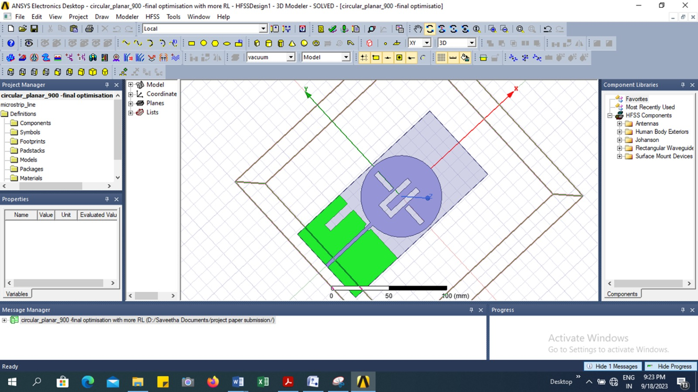

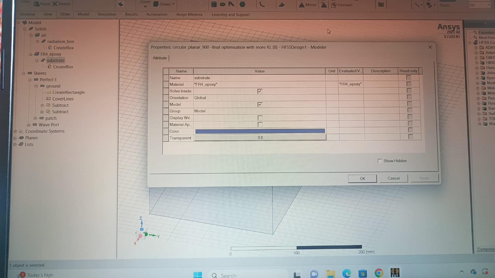

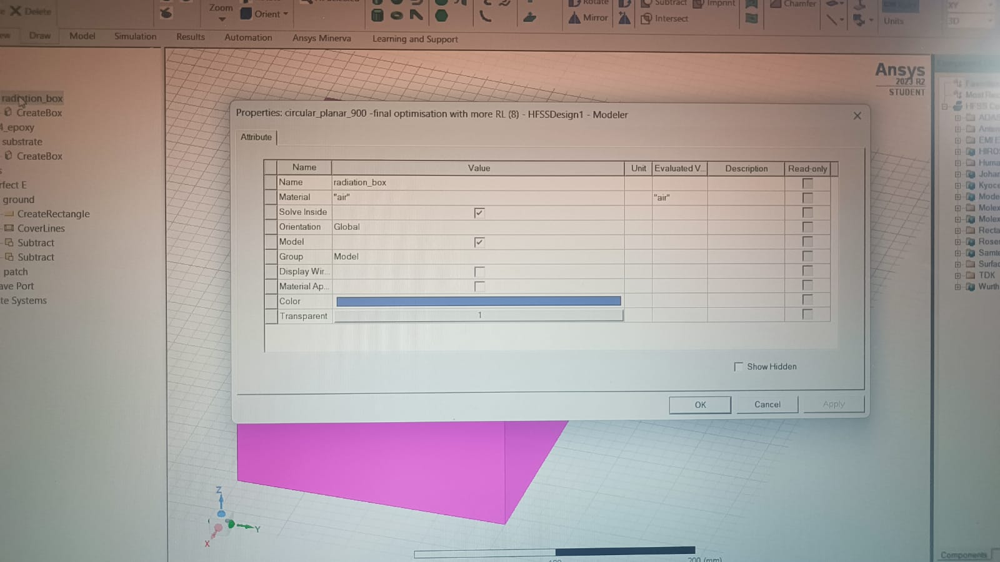

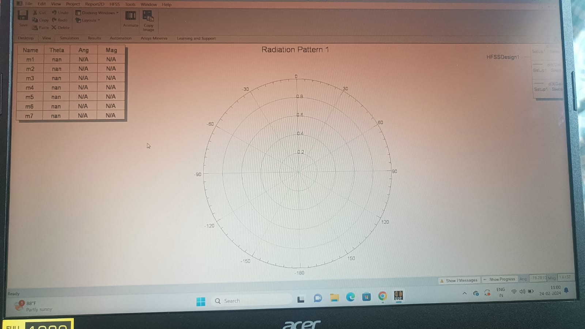

